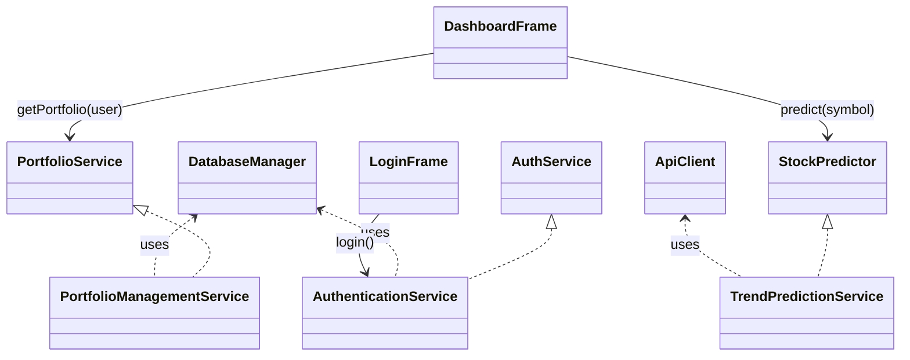
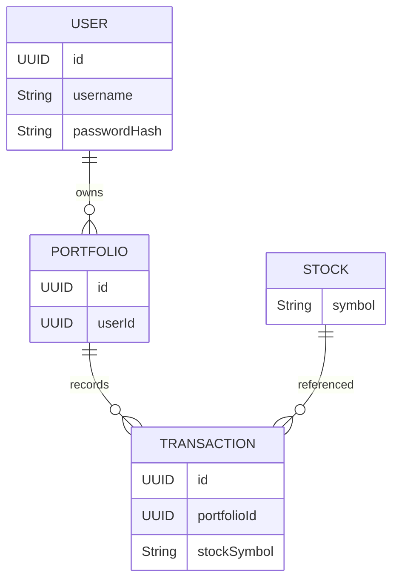

# ApiClient.java

This class handles HTTP communications with an external stock data API. It provides methods to fetch market data and predictions by encapsulating request/response logic.

- Uses `java.net.HttpURLConnection` for HTTP requests.  
- Parses JSON responses into domain models (e.g., `Candle`).  
- Throws `IOException` on network errors.  

### Key Methods

```java
public List<Candle> getHistoricalData(String symbol, LocalDate start, LocalDate end) throws IOException
public double getPrediction(String symbol) throws IOException
```

- **getHistoricalData**: Fetches OHLC data between two dates.  
- **getPrediction**: Retrieves a numeric trend prediction for a ticker.  

### Relationships

- Used by `TrendPredictionService` to obtain raw market data.  
- Independent of database layer.  

### Methods in Detail

This section explains the intent, inputs, and outputs for each public method. It helps you understand how to call them correctly.

- **`getHistoricalData(String symbol, LocalDate start, LocalDate end)`**  
  - **Purpose**: Retrieve a time series of candles for a given ticker and period.  
  - **Parameters**:  
    - `symbol`: Stock ticker, for example `"AAPL"` or `"GOOG"`.  
    - `start`: First date to include in the historical series.  
    - `end`: Last date to include in the historical series.  
  - **Return value**:  
    - A `List<Candle>` ordered by date, usually from oldest to newest.  
  - **Typical usage**:  
    - Pass it into analytics code, such as moving average or volatility calculators.  
    - Use it in charting components to display historical prices.  

- **`getPrediction(String symbol)`**  
  - **Purpose**: Ask the remote API for a concise numeric prediction.  
  - **Parameters**:  
    - `symbol`: Target stock ticker for which you want a score.  
  - **Return value**:  
    - A `double` that represents a trend metric, for example growth strength.  
  - **Typical usage**:  
    - Display the value in `DashboardFrame` as a prediction indicator.  
    - Feed it into higher level decision logic, such as recommendation rules.  

### Error Handling and Network Behaviour

This class must handle remote failures gracefully. You should expect and handle network errors in calling code.

- Methods throw `IOException` when the network stack fails.  
- Timeouts or unreachable hosts should not crash the UI; catch exceptions in services.  
- Invalid API responses should either log errors or raise parsing exceptions.  
- Callers should also validate input symbols before making remote calls.  

---

# DatabaseManager.java

This singleton manages JDBC connections to the relational database. It centralizes connection pooling and teardown.

- Loads DB credentials from configuration.  
- Provides `getConnection()` and `closeConnection(Connection)`.  
- Ensures a single `DataSource` is used application-wide.  

### Core API

```java
public Connection getConnection() throws SQLException
public void closeConnection(Connection conn)
```

- **getConnection**: Returns a new or pooled connection.  
- **closeConnection**: Safely returns connection to pool.  

### Relationships

- Consumed by all service implementations (`AuthenticationService`, `PortfolioManagementService`, etc.).  
- Tested by `TestConnection`.  

### Methods in Detail

These methods wrap low level JDBC resource management. They hide configuration details from the rest of the application.

- **`getConnection()`**  
  - **Purpose**: Provide a ready to use `Connection` configured with correct URL and credentials.  
  - **Return value**:  
    - A live `Connection` instance, usually from a pool or direct driver manager.  
  - **Behaviour**:  
    - Throws `SQLException` if it cannot reach the database.  
    - Should set reasonable defaults, for example auto commit or timeouts.  

- **`closeConnection(Connection conn)`**  
  - **Purpose**: Release the database resource safely.  
  - **Parameters**:  
    - `conn`: The `Connection` returned by `getConnection()`.  
  - **Behaviour**:  
    - Null safe; should check for `null` before closing.  
    - Swallows or logs closing exceptions to avoid secondary failures.  

### Usage Best Practices

You should always acquire and release connections in a `try` and `finally` pattern. This avoids connection leaks.

```java
Connection conn = null;
try {
    conn = DatabaseManager.getInstance().getConnection();
    // business logic using conn
} finally {
    DatabaseManager.getInstance().closeConnection(conn);
}
```

- Wrap database operations inside transactions when multiple statements must succeed together.  
- Prefer prepared statements to prevent SQL injection and improve performance.  

---

# TestConnection.java

A simple utility with a `main` method to verify database connectivity.  

- Executes a trivial query (`SELECT 1`) to confirm setup.  
- Prints success or error details to console.  

```bash
java com.database.TestConnection
```

- Exit code 0 on success, non-zero on failure.  

### Class and Method Behaviour

This class is usually run manually during setup or troubleshooting. It isolates connection issues from the rest of the code.

- **`main(String[] args)`**  
  - Obtains a `Connection` from `DatabaseManager`.  
  - Executes a tiny query, such as `SELECT 1`, using JDBC.  
  - Logs success when the query returns, or logs an error on exception.  
  - Closes the connection at the end, regardless of outcome.  

---

# gui.java

Entry point for the graphical interface. It sets look-and-feel and launches the login window.

- Configures Swing UI defaults.  
- Instantiates `LoginFrame`.  

```java
public static void init() {
    // set UI theme
    new LoginFrame().setVisible(true);
}
```

- Called by `Main.main(...)` to start the application.  

### Class Role in the GUI Layer

The `gui` class acts as an adapter between core startup code and Swing. It centralises initial UI configuration.

- It chooses the look and feel for all Swing components, for example Nimbus or system default.  
- It may configure global fonts, colors, or UIManager properties before any window shows.  
- It owns the logic that decides which frame to show first, here the `LoginFrame`.  

### `init()` Method in Detail

The `init()` method bootstraps the entire user interface. This is where Swing windows enter the event dispatch thread.

- **Steps performed**:  
  - Optionally set `UIManager.setLookAndFeel(...)` to adjust overall style.  
  - Create a new instance of `LoginFrame`.  
  - Call `setVisible(true)` to display the login window.  
- **Threading considerations**:  
  - In production ready code, you should call `init()` from `SwingUtilities.invokeLater`.  
  - This ensures all Swing work runs on the event dispatch thread.  

---

# LoginFrame.java

🔒 Handles user authentication via a simple Swing form.

- Fields: username, password, **Login** button.  
- On submit, calls `AuthenticationService.login(username, password)`.  
- On success, disposes itself and opens `DashboardFrame`.  

```java
loginButton.addActionListener(e -> {
    User user = authService.login(userField.getText(), passField.getPassword());
});
```

### Class Structure and Components

`LoginFrame` extends `JFrame` and contains all widgets required to collect credentials. It focuses on a minimal, clear layout.

- Typical components:  
  - `JLabel` for username and password labels.  
  - `JTextField` or `JFormattedTextField` for the username input.  
  - `JPasswordField` for secure password entry.  
  - `JButton` for the login action, and optionally a cancel button.  
  - A small `JLabel` or `JOptionPane` for showing error messages.  
- Layout:  
  - Often uses `BorderLayout`, `GridBagLayout`, or a simple `GridLayout` for form alignment.  
  - Centers itself on screen when displayed.  

### Login Flow in Detail

This describes how user actions travel from the GUI to the services and back. It connects button presses to authentication results.

- User types username and password into the respective fields.  
- When the login button is pressed, an `ActionListener` validates inputs locally.  
- If basic validation passes, it calls `AuthenticationService.login(...)`.  
- The service checks the database and returns a `User` object or `null`.  
- On success:  
  - The frame may store the `User` in memory, such as in a session object.  
  - It disposes `LoginFrame` and opens `DashboardFrame` for that user.  
- On failure:  
  - It shows an error dialog or inline message.  
  - It may clear the password field for security reasons.  

### Example Pseudocode for Event Handling

The following pseudocode illustrates the high level structure of the frame. It is not exact code, but it shows typical ideas.

```java
public class LoginFrame extends JFrame {

    private final AuthenticationService authService;

    public LoginFrame(AuthenticationService authService) {
        this.authService = authService;
        initComponents();
        initListeners();
    }

    private void initComponents() {
        // create labels, text fields, button
        // configure layout and add components
        pack();
        setLocationRelativeTo(null); // center on screen
    }

    private void initListeners() {
        loginButton.addActionListener(e -> onLogin());
    }

    private void onLogin() {
        String username = userField.getText();
        char[] password = passField.getPassword();
        User user = authService.login(username, password);
        if (user != null) {
            new DashboardFrame(user).setVisible(true);
            dispose();
        } else {
            showError("Invalid credentials");
        }
    }
}
```

- This pattern keeps UI logic and service calls clearly separated.  
- The constructor receives dependencies, which simplifies testing.  

---

# DashboardFrame.java

📊 The main application dashboard after login.

- Displays portfolio summary, transactions table, prediction chart.  
- Injects `PortfolioService` and `StockPredictor`.  
- Refresh button reloads data and updates UI components.  

```java
List<Stock> holdings = portfolioService.getPortfolio(user);
double trend = stockPredictor.predict(symbol);
```

### Class Structure and Responsibilities

`DashboardFrame` also extends `JFrame` and works as the main workspace. It aggregates several panels that show financial information.

- Typical sections:  
  - **Header panel**: Greets the user and may offer a logout button.  
  - **Holdings panel**: Displays current portfolio positions in a table.  
  - **Transactions panel**: Lists historical buys and sells for the active portfolio.  
  - **Prediction panel**: Shows trend predictions, such as numeric scores or simple charts.  
- Data dependencies:  
  - Needs a `User` or `Portfolio` instance to know what to load.  
  - Uses `PortfolioService` to read holdings and transactions from the database.  
  - Uses `StockPredictor` to calculate predictions for selected symbols.  

### Data Refresh and Interaction Flow

This frame reacts to user actions, for example clicking refresh or executing trades. It translates those actions into service calls.

- **On load**:  
  - It calls `portfolioService.getPortfolio(user)` to retrieve the current portfolio.  
  - It populates tables with holdings and transaction data.  
- **On refresh button click**:  
  - It reloads holdings and transaction lists from the database.  
  - It re-runs prediction logic for any focused stock ticker.  
  - It updates all UI components to show the latest values.  
- **On row selection**:  
  - When the user selects a specific stock row, it may call `stockPredictor.predict(symbol)`.  
  - It can update a dedicated prediction panel with the new score.  

### Example Pseudocode for Dashboard Layout

This snippet shows one possible approach to structuring the dashboard. Your actual code may differ but follow similar ideas.

```java
public class DashboardFrame extends JFrame {

    private final PortfolioService portfolioService;
    private final StockPredictor stockPredictor;
    private final User user;

    public DashboardFrame(User user, PortfolioService portfolioService, StockPredictor stockPredictor) {
        this.user = user;
        this.portfolioService = portfolioService;
        this.stockPredictor = stockPredictor;
        initComponents();
        loadData();
    }

    private void initComponents() {
        // create tables, labels, buttons, and panels
        // configure layouts and add components to the frame
        pack();
        setLocationRelativeTo(null);
    }

    private void loadData() {
        Portfolio portfolio = portfolioService.getPortfolio(user);
        // fill tables with holdings and transactions from portfolio
    }

    private void onRefresh() {
        loadData();
        // recompute predictions for visible stocks
    }
}
```

- This design separates loading, layout, and event handling logic.  
- It makes testing and future expansion of the dashboard easier.  

---

# AuthService.java

Defines authentication operations.

- `User login(String username, char[] password)`
- `boolean register(Person person)`

Any implementation must handle credential storage and verification.

### Methods in Detail

The interface defines the minimal contract for authentication. Concrete classes like `AuthenticationService` must implement these methods.

- **`login(String username, char[] password)`**  
  - **Purpose**: Authenticate the user and return a domain `User` if successful.  
  - **Parameters**:  
    - `username`: Login name or identifier typed in the GUI.  
    - `password`: Password as a `char[]` to allow secure erasure.  
  - **Return value**:  
    - A `User` object when credentials are correct; otherwise `null` or an exception.  
  - **Typical behaviour**:  
    - Validate empty fields.  
    - Compare provided password with a stored password hash from the database.  

- **`register(Person person)`**  
  - **Purpose**: Create a new account based on person registration data.  
  - **Parameters**:  
    - `person`: Data holder containing name, email, and raw password.  
  - **Return value**:  
    - `true` when the user is stored successfully; `false` or exception otherwise.  
  - **Typical behaviour**:  
    - Validate that username or email is unique.  
    - Hash the password before persisting to the database.  

---

# PortfolioService.java

Abstracts portfolio management logic.

- `Portfolio getPortfolio(User user)`
- `boolean buyStock(User u, Stock s, int qty)`
- `boolean sellStock(User u, Stock s, int qty)`
- `List<Transaction> getTransactions(Portfolio p)`

### Methods in Detail

These methods represent core portfolio operations. Implementations take care of correct persistence and business rules.

- **`getPortfolio(User user)`**  
  - **Purpose**: Retrieve the portfolio associated with a specific user.  
  - **Parameters**:  
    - `user`: The authenticated user currently using the system.  
  - **Return value**:  
    - A `Portfolio` object reflecting current holdings and maybe metadata.  

- **`buyStock(User u, Stock s, int qty)`**  
  - **Purpose**: Register a purchase of a stock in the user portfolio.  
  - **Parameters**:  
    - `u`: Owner of the portfolio.  
    - `s`: Stock being purchased.  
    - `qty`: Quantity of units to buy.  
  - **Return value**:  
    - `true` if the buy operation succeeded in the database.  
  - **Business concerns**:  
    - It should check that quantity is positive.  
    - It may also validate budget or constraints, depending on requirements.  

- **`sellStock(User u, Stock s, int qty)`**  
  - **Purpose**: Register a sale of holdings from the portfolio.  
  - **Parameters**: Same as `buyStock`.  
  - **Return value**:  
    - `true` if the sale was applied correctly.  
  - **Business concerns**:  
    - Must verify that the user holds at least the requested quantity.  
    - Should update both holdings and create a `Transaction` record.  

- **`getTransactions(Portfolio p)`**  
  - **Purpose**: Fetch the transaction history associated with a portfolio.  
  - **Parameters**:  
    - `p`: The target portfolio whose history you need to inspect.  
  - **Return value**:  
    - A `List<Transaction>` sorted usually by date descending.  

---

# StockPredictor.java

Interface for trend-prediction algorithms.

- `double predict(String symbol)`

Allows multiple implementations (e.g., moving average, ML).

### Method in Detail

This method provides a simple abstraction over any prediction algorithm. Implementations hide all details of data fetching and computation.

- **`predict(String symbol)`**  
  - **Purpose**: Produce a numeric prediction for a single stock ticker.  
  - **Parameters**:  
    - `symbol`: Identifier of the stock to evaluate.  
  - **Return value**:  
    - A `double` score that indicates future trend or performance.  
  - **Interpretation**:  
    - Your UI or business logic decides whether high or low numbers mean positive signals.  

---

# Candle.java

Model for market data point (OHLC).

| Field     | Type      | Description              |
|-----------|-----------|--------------------------|
| timestamp | LocalDate | Date of the data point   |
| open      | double    | Opening price            |
| high      | double    | Highest price            |
| low       | double    | Lowest price             |
| close     | double    | Closing price            |
| volume    | long      | Trade volume             |

### Class Role and Methods

The `Candle` class acts as an immutable or simple data container. It represents a single bar in a price chart.

- Primary responsibilities:  
  - Carry OHLC data between layers, for example from `ApiClient` to `TrendPredictionService`.  
  - Provide getters for each field, such as `getOpen()` or `getClose()`.  
  - Optionally expose computed helpers, such as `getMidPrice()` or `isBullish()`.  

```java
public class Candle {
    private LocalDate timestamp;
    private double open;
    private double high;
    private double low;
    private double close;
    private long volume;

    // constructor, getters, maybe toString or equals
}
```

- It can easily serialize to JSON or database rows if needed.  
- Plain structure keeps analytical code clear and focused.  

---

# Person.java

Intermediate model for user registration.

- Fields: `firstName`, `lastName`, `email`, `password`.  
- Validates non-null name and email format.  

### Class Usage and Methods

This class separates raw registration data from the persisted `User` entity. It is convenient for onboarding forms.

- Typical fields and methods:  
  - Private fields for all registration attributes.  
  - Public getters and setters used by controllers or forms.  
  - Validation helpers, for example `isEmailValid()` or `hasRequiredFields()`.  

```java
public class Person {
    private String firstName;
    private String lastName;
    private String email;
    private String password;

    // constructors, getters, setters, helper validation methods
}
```

- The registration process usually converts a `Person` into a `User` with a hashed password.  

---

# Portfolio.java

Represents a user’s investment portfolio.

- `id` (UUID)  
- `User owner`  
- `Map<Stock, Integer> holdings`  
- `List<Transaction> transactions`  

### Class Semantics and Behaviour

The `Portfolio` class models the logical grouping of assets for a single user. It aggregates both current state and historical actions.

- **Core responsibilities**:  
  - Track which stocks the user owns and how many units of each.  
  - Aggregate transactions associated with buying and selling.  
  - Expose helper methods such as `getTotalValue()` when provided with prices.  

```java
public class Portfolio {
    private UUID id;
    private User owner;
    private Map<Stock, Integer> holdings;
    private List<Transaction> transactions;

    // constructors, getters, setters
}
```

- The service layer updates `holdings` and `transactions` when operations occur.  

---

# Stock.java

Encapsulates a tradable security.

| Field  | Type   | Description        |
|--------|--------|--------------------|
| symbol | String | Ticker symbol      |
| name   | String | Company name       |
| price  | double | Latest known price |

### Class Role and Typical Methods

`Stock` provides a simple representation of an instrument used across services and UI. It often appears inside collections or maps.

- Common methods:  
  - Getters and setters for `symbol`, `name`, and `price`.  
  - `toString()` that returns a human readable form, for example `"AAPL - Apple Inc."`.  
  - `equals` and `hashCode` based on `symbol`, which allows use as a map key.  

```java
public class Stock {
    private String symbol;
    private String name;
    private double price;

    // constructors, getters, setters, equals, hashCode
}
```

- The price field is often updated from API responses or market feeds.  

---

# Transaction.java

Records a buy/sell event.

- `id` (UUID)  
- `Portfolio portfolio`  
- `Stock stock`  
- `int quantity`  
- `double pricePerUnit`  
- `LocalDateTime timestamp`  
- `enum Type { BUY, SELL }`  

### Class Semantics and Methods

A `Transaction` instance describes a single executed order. It is essential for audit trails and portfolio calculations.

- Data usage:  
  - Services store transactions in the database as immutable records.  
  - The dashboard displays them in historical tables.  
- Common methods:  
  - Getters for each field.  
  - Helper to compute the total value: `quantity * pricePerUnit`.  
  - Optional method to check whether it is a buy or sell, for example `isBuy()`.  

```java
public class Transaction {
    private UUID id;
    private Portfolio portfolio;
    private Stock stock;
    private int quantity;
    private double pricePerUnit;
    private LocalDateTime timestamp;
    private Type type;

    public enum Type { BUY, SELL }
}
```

- Order of operations and timestamps matter for performance analytics.  

---

# User.java

Domain model for application users.

- `UUID id`  
- `String username`  
- `String passwordHash`  
- `String role` (e.g., ADMIN, USER)  
- `List<Portfolio> portfolios`  

### Class Role and Common Methods

The `User` class represents individuals who log into the system. It is central for authentication and authorization.

- Responsibilities:  
  - Store credentials in safe form, such as a password hash and optional salt.  
  - Associate one or more portfolios that the user owns.  
  - Carry role or permission flags, for example `ADMIN` or `TRADER`.  

```java
public class User {
    private UUID id;
    private String username;
    private String passwordHash;
    private String role;
    private List<Portfolio> portfolios;

    // constructors, getters, setters
}
```

- Services like `AuthenticationService` create and load `User` objects from the database.  

---

# AuthenticationService.java

🔐 Implements `AuthService` using `DatabaseManager`.

- **login**: Verifies username/password against stored hash.  
- **register**: Inserts new user record with hashed password.  

```java
public User login(...) {
    Connection conn = db.getConnection();
    // query users table
}
```

### Methods in Detail

This class turns interface methods into real JDBC operations. It encapsulates SQL and password handling.

- **`login(String username, char[] password)`**  
  - **Flow**:  
    - Acquire a connection from `DatabaseManager`.  
    - Query the `users` table for a record with the given username.  
    - Compare the provided password with the stored hash using a secure algorithm.  
    - Construct and return a `User` if the match succeeds.  
  - **Error handling**:  
    - May return `null` or throw a custom exception on invalid credentials.  
    - Logs or wraps `SQLException` into application level exceptions.  

- **`register(Person person)`**  
  - **Flow**:  
    - Validate registration data from the `Person` instance.  
    - Check for duplicate usernames or emails.  
    - Hash the raw password and prepare an `INSERT` statement.  
    - Execute the statement and possibly create an initial empty portfolio.  
  - **Security**:  
    - Must never store plaintext passwords.  
    - Should use strong hashing algorithms like BCrypt or Argon2 in production.  

---

# PortfolioManagementService.java

💼 Implements `PortfolioService` using `DatabaseManager` and `ApiClient`.

- **getPortfolio**: Loads holdings and transactions from DB.  
- **buyStock / sellStock**: Inserts a `Transaction` and updates holdings.  
- **getTransactions**: Fetches history for display.  

### Methods in Detail

This service coordinates between database state and portfolio business rules. It ensures all updates remain consistent.

- **`getPortfolio(User user)`**  
  - Loads the portfolio rows matching the user identifier from the database.  
  - Joins or performs follow up queries to load holdings and transactions.  
  - Maps these rows into `Portfolio`, `Stock`, and `Transaction` objects.  

- **`buyStock(User u, Stock s, int qty)`**  
  - Validates input quantity and ensures stock symbol exists.  
  - Starts a transaction on the database connection.  
  - Inserts a `Transaction` with type `BUY` and updates holdings table.  
  - Commits on success or rolls back on any error.  

- **`sellStock(User u, Stock s, int qty)`**  
  - Checks that current holdings contain enough quantity to sell.  
  - Inserts a `Transaction` with type `SELL`.  
  - Decreases the holdings quantity, removing the row when it hits zero.  

- **`getTransactions(Portfolio p)`**  
  - Queries the `transactions` table filtered by portfolio identifier.  
  - Sorts records, often by timestamp descending, for showing latest first.  
  - Returns them as a list to `DashboardFrame` or other consumers.  

### Integration with ApiClient

Although the main role is database work, this service can also use `ApiClient`. It allows combining static holdings with live market prices.

- It can fetch current prices to calculate up to date portfolio value.  
- It may also use API data to attach richer information to each `Stock`.  

---

# TrendPredictionService.java

📈 Implements `StockPredictor` using `ApiClient`.

1. Fetch historical `Candle` data.  
2. Apply simple moving average or predictive algorithm.  
3. Return numeric trend score.  

```java
List<Candle> history = apiClient.getHistoricalData(symbol, start, end);
double trend = computeMovingAverage(history);
```

### Method in Detail

The main method implements the `StockPredictor` interface. It hides all lower level prediction logic.

- **`predict(String symbol)`**  
  - Chooses a historical period, for example the last 30 or 90 days.  
  - Calls `ApiClient.getHistoricalData(symbol, start, end)` to get candles.  
  - Runs a prediction algorithm like moving average crossover or regression.  
  - Produces a `double` value that summarizes the forecast.  

### Algorithm Considerations

The exact prediction approach can evolve without affecting callers. The only contract is the input symbol and numeric output.

- Simple methods:  
  - Average closing price and compare to current price.  
  - Compute recent momentum or percentage change.  
- Advanced methods:  
  - Use machine learning models trained offline.  
  - Combine technical indicators, volatility, and volume signals.  

---

# Main.java

The application entry point.

1. Initializes `DatabaseManager`.  
2. Calls `gui.init()` to launch the Swing UI.  

```java
public static void main(String[] args) {
    DatabaseManager.init();
    gui.init();
}
```

### Method and Startup Flow

The `main` method ties backend initialization and GUI startup together. It should remain as simple as possible.

- **Typical responsibilities**:  
  - Load configuration, such as database URL and API keys.  
  - Initialize singletons like `DatabaseManager`.  
  - Create service instances and wire dependencies if not using a framework.  
  - Call `gui.init()` so the user interface can take over.  

---

## Architecture Overview




